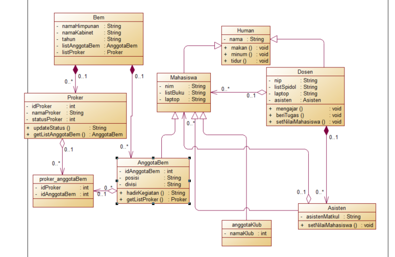
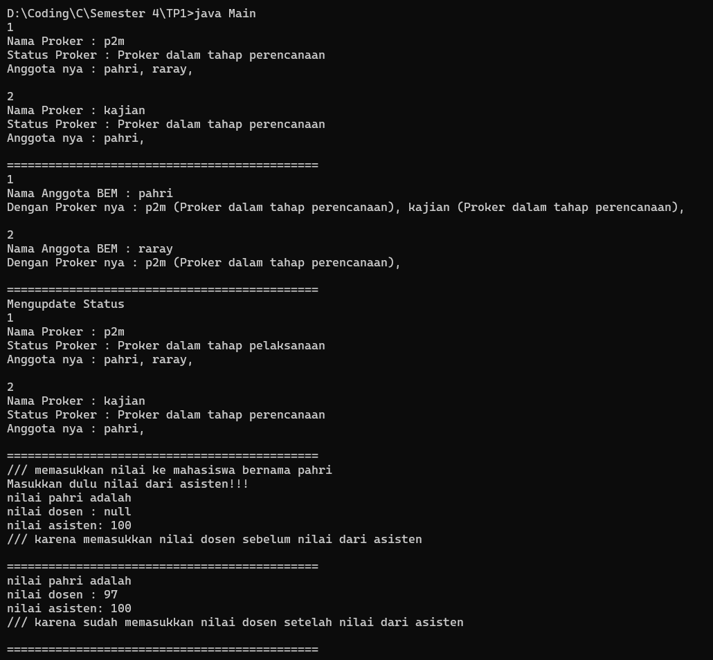

## Janji
Saya Fachri Najm Noer Kartiman NIM 2106515 mengerjakan soal TP 1
dalam mata kuliah Desain Pemrograman Berorientasi Objek untuk keberkahanNya
maka saya tidak melakukan kecurangan seperti yang telah dispesifikasikan.
Aamiin.

# Tugas TP1DPBO2023
* Diperbolehkan menambah atribut / properti baru.
* Buatlah Class Diagram dari desain yang telah dirancang, serta berikan penjelasannya!
* Pilihlah satu bahasa yang disukai / dikuasai, kecuali PHP.
* Diperbolehkan menggunakan konsep yang belum diajarkan, seperti polimorfisme (overload – override), kelas abstrak, interface, dan sebagainya.
* Batas waktu: 14 Maret 2023, 23.59

File README berisi desain program, penjelasan alur, dan dokumentasi saat program dijalankan (screenshot/screen record, pilih salah satu bahasa sebagai contoh)

Submit link repository pada form berikut: [Form Pengumpulan](https://forms.gle/rvb1hKxbQVuYNbhKA) 

## Desain Program

Class Human sebagai parent dari Mahasiswa dan Dosen karena Dosen dan Mahasiswa memiliki atribut dan method yang dimiliki oleh Human

Dosen melakukan composite terhadap Asisten karena dosen _Has a_ asisten

Dosen dan Asisten melakukan agregasi terhadap Mahasiswa untuk memanipulasi nilai yang dimiliki oleh mahasiswa (asumsi Mahasiswa hanya memiliki satu nilai saja) 

Mahasiswa sebagai parent dari anggotaBem, anggotaKlub, Asisten karena 3 class tersebut memiliki atribut dan method yang dimiliki oleh Mahasiswa

Bem melakukan composite ke Proker dan AnggotaBem karena Bem _Has a_ Proker dan AnggotaBem 

Proker dan AnggotaBem terhubung dengan `relation many to many `dengan perantara Class ProkerAnggotaBem. Kenapa `relation many to many` ? Karena aku pengen tau list anggotaBem yang termasuk dalam satu proker dan pengen tau proker apa saja yang sedang dijalani anggotaBem

## Alur Program
**inputan secara hardcore dari codenya**

## Penjelasan Program & Dokumentasi

Menampilkan proker dengan list panitia nya dan sebaliknya

Program ini dapat mengupdate status dari Proker (tahap perencanaan, dijalankan, evaluasi), dan anggotaBem yang jadi panitia proker tersebut tau stats proker tersebut

Dosen tidak bisa memberi nilai pada mahasiswa sebelum asisten memberi nilai (jika memaksa memberi nilai return null)

**Program Java**

1. Menampilkan proker beserta amggotaBem yang jadi panitia dari proker tersebut
2. Menampilkan AnggotaBem dan proker yang sedang dijalankannya
3. Mengupdate status proker
4. Memasukkan nilai dosen sebelum nilai asisten (return null)
5. Memasukkan nilai dosen setelah nilai dosen 